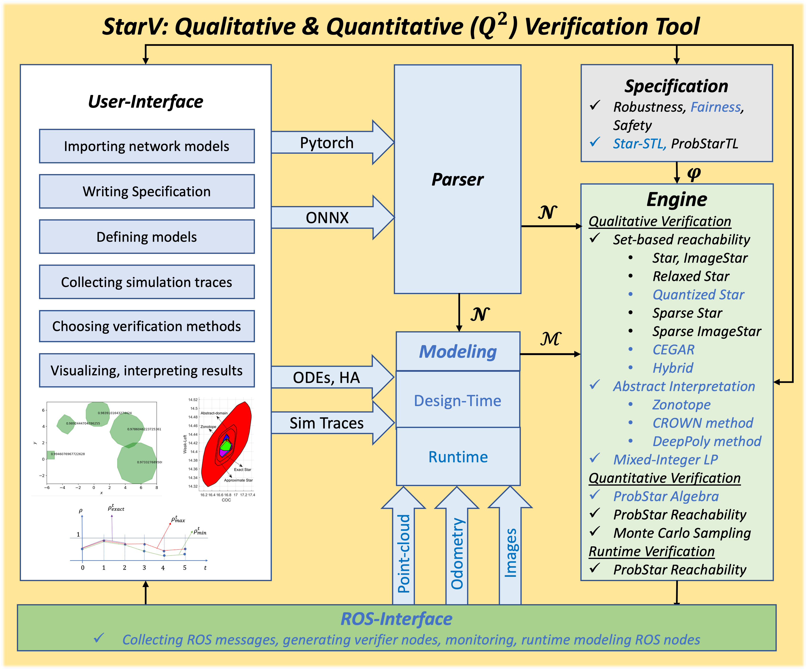

<p align="right">
<a href="https://github.com/V2A2"></a>
</p>


# StarV

Event-driven Monitoring and Verification Codesign for Distributed Learning-enabled Cyber-Physical Systems with Star Reachability

* Operating System: Ubuntu 20, 22. <!-- - RAM: at least 64 GB -->
* Python version: 3.8+
* Dependencies: gurobipy, glpk, polytope, pypoman, tabulate, mathplotlib, numpy, scipy, ipyparallel, torchvision, plotly, onnx, onnx2pytorch, onnxruntime, scikit-learn
* Key features:
  1. Qualitative and quantitative verification algorithms for deep neural networks and distributed Le-CPS
  2. Probabilistic Star Temporal Logic (under development)
  3. Monitoring algorithms (under development)
  4. Target ROS-based applications (under development)
* The user manual is availble at StarV root directory, `StarV`

<p align="center">
<a href="https://github.com/V2A2/StarV"></a>
</p>

## Installation

Clone the StarV repository:

```bash
git clone https://github.com/V2A2/StarV
```

File structure:

```
StarV (root directory)
│    README.md (main tool)
|    manual.pdf
│    requirements.txt
│    gurobi.lic (for Docker usage)
│    setup.py
│    ...  
│
└───.devcontainer
│   │    Docker scripts
│
└───StarV (dev directory)
│   │    All main algorithm scripts
│   
└───artifacts
    │   └───CAV2025_StarV_Tool
    │   │   │    CAV2025_StarV_Tool.py
    │   │   │    README.md (artifact)
    │   │   │    CAV2025_StarV_Tool_Paper.pdf
└───tests
│   │   all testing scripts
│   │   ...   
└───tutorials
│   └───reachable_sets
│       │    tutorial scripts
│   └───layers
│       │    tutorial scripts
│   └───...
```

### Option 1: Running with Local Machine

#### Gurobi Installation on Ubuntu

**Dowload Gurobi and extract.**
Go to https://www.gurobi.com/downloads/ and download the correct version of Gurobi.
Or use the following command:

```bash
wget https://packages.gurobi.com/10.0/gurobi10.0.1_linux64.tar.gz
```

https://www.gurobi.com/documentation/10.0/remoteservices/linux_installation.html recommends installing Gurobi `/opt` for a shared installtion. Note: One might have to create the ~/opt/ directory using mkdir ~/opt first.

```bash
mv gurobi10.0.1_linux64.tar.gz ~/opt/
```

Move into the directory and extract the content.

```bash
cd ~/opt/
tar -xzvf gurobi10.0.1_linux64.tar.gz
rm gurobi10.0.1_linux64.tar.gz
```

**Setting up the environment variables.**
Open the `~/.bashrc` file.

```bash
vim ~/.bashrc
```

Add the following lines, replacing {PATH_TO_YOUR_HOME} with the _aboslute_ path to your home directory, and save the file:

```bash
export GUROBI_HOME="{PATH_TO_YOUR_HOME}/opt/gurobi1001/linux64"
export GRB_LICENSE_FILE="{PATH_TO_YOUR_HOME}/gurobi.lic"
export PATH="${PATH}:${GUROBI_HOME}/bin"
export LD_LIBRARY_PATH="${LD_LIBRARY_PATH}:${GUROBI_HOME}/lib"
```

Note: If one installed Gurobi or the license file into a different directory, one has to adjust the paths in the first two lines.
After saving, reload .bashrc:

```bash
source ~/.bashrc
```

**Acquire your license from https://www.gurobi.com/academia/academic-program-and-licenses/**
At `~/opt/gurobi1001/linux64/bin` copy the `grbgetkey` line from the site and enter it into a terminal. Please save the gurobi license `gurobi.lic` in the corresponding directory to `GRB_LICENSE_FILE="{PATH_TO_YOUR_HOME}/gurobi.lic"`.

#### Installation and setup

**Install Ubuntu packages:**

```bash
sudo apt-get install python3-dev python3-pip libgmp-dev libglpk-dev libgmp3-dev 
```

**set up conda environment:**

```bash
# Remove the old environment, if necessary.
conda deactivate; conda env remove -n starv
# Install all dependencies into the starv environment
conda create -n starv python=3.8
# activate the environment
conda activate starv
# Deactivate the environment when you are done
conda deactivate
```

**Install StarV as a local Python package:** while installing StarV package, it will install all Python dependency packages listed in the requirement.txt. Run the following command at the ``/StarV`` **root repository**:

```bash
# activate the environment
conda activate starv
# install starV as a local Python package
pip3 install -e .
```

The requirement.txt contains the following Python dependency packages:

```bash
gurobipy==11.0.3
glpk
pycddlib<=2.1.8
polytope
pypoman
tabulate
matplotlib
numpy<=1.26.4
scipy<1.13.1
ipyparallel
torchvision
plotly==5.14.1
onnx
onnx2pytorch
onnxruntime
scikit-learn
```

### Option 2: Running with Docker

Acquire Gurobi Web License Service (WLS) license from https://www.gurobi.com/features/web-license-service/ for Docker container. 
Place ``gurobi.lic`` at ``/StarV`` root directory.

```
StarV (root directory)
│    gurobi.lic (for Docker usage)
│    setup.py
│    ...  
│
└───.devcontainer
│   │    build_docker.sh
│   │    launch_docker.sh
│   │    ...
│
└───StarV (dev directory)│   
│   
└─── ...
```

At the ``/StarV`` **root directory**, build the docker:

```bash
sh .devcontainer/build_docker.sh
```

Launch the docker image:

```bash
sh .devcontainer/launch_docker.sh
```

## Tests

```
StarV (root directory)
│    ...  
└───.devcontainer
└───StarV (dev directory)
└───artifacts
└───tests
│   │   all testing scripts
│   │   ...   
└───tutorials
```

To run the testing scripts, navigate to the ``StarV/tests/`` and execute python scripts. For example, to run testing script for ProbStar set, you just run:

```bash
conda activate starv # activate the conda environment if you followed the option 1 for installation, ignore this command if you installed it with Docker
cd tests
python3 test_set_probstar.py
```

## Tutorials

The user manual is availble at StarV root directory, `StarV`. The code for the tutorials are consistent with the user manual.

```
StarV (root directory)
│    ...  
│   manual.pdf
└───.devcontainer
└───StarV (dev directory)
└───artifacts
└───tests  
└───tutorials
│   └───reachable_sets
│       │    tutorial scripts
│   └───reachability_analysis
│       │    tutorial scripts
│   └───...
```

To run the tutorial scripts, navigate to the ``StarV/tutorials/reachable_sets/`` and execute python scripts. For example, to run tutorial script for Star set, you just run:

```bash
conda activate starv # activate the conda environment if you followed the option 1 for installation, ignore this command if you installed it with Docker
cd tutorials/reachable_sets
python3 tutorial_star.py
```

## Publications
- **StarV Tool** ([Tran et al. CAV 2025])
- **ProbStarTL** ([Tran et al. HSCC 2025])
- **SparseStar LSTM & GRU** ([Choi et al. NAHS 2025](https://doi.org/10.1016/j.nahs.2025.101581))
- **ProbStar** ([Tran et al. HSCC 2023](https://dl.acm.org/doi/10.1145/3575870.3587112))
- **Star RNN** ([Tran et al. HSCC 2023](https://dl.acm.org/doi/10.1145/3575870.3587128))
- **Sigmoidal NN** ([Choi et al. TECS 2023](https://dl.acm.org/doi/10.1145/3627991))
- **ImageStar SSNN** ([Tran et al. CAV 2021](https://doi.org/10.1007/978-3-030-81685-8_12))
- **ImageStar** ([Tran et al. CAV 2020](https://dl.acm.org/doi/10.1007/978-3-030-53288-8_2))
- **Star** ([Tran et al. FM 2019](https://dl.acm.org/doi/10.1007/978-3-030-30942-8_39))


```
@article{choi2025reachability,
  title={Reachability analysis of recurrent neural networks},
  author={Choi, Sung Woo and Li, Yuntao and Yang, Xiaodong and Yamaguchi, Tomoya and Hoxha, Bardh and Fainekos, Georgios and Prokhorov, Danil and Tran, Hoang-Dung},
  journal={Nonlinear Analysis: Hybrid Systems},
  volume={56},
  pages={101581},
  year={2025},
  publisher={Elsevier}
}

@inproceedings{tran2023quantitative,
  title={Quantitative verification for neural networks using probstars},
  author={Tran, Hoang-Dung and Choi, Sungwoo and Okamoto, Hideki and Hoxha, Bardh and Fainekos, Georgios and Prokhorov, Danil},
  booktitle={Proceedings of the 26th ACM International Conference on Hybrid Systems: Computation and Control},
  pages={1--12},
  year={2023}
}

@inproceedings{tran2023verification,
  title={Verification of recurrent neural networks with star reachability},
  author={Tran, Hoang Dung and Choi, Sung Woo and Yang, Xiaodong and Yamaguchi, Tomoya and Hoxha, Bardh and Prokhorov, Danil},
  booktitle={Proceedings of the 26th ACM International Conference on Hybrid Systems: Computation and Control},
  pages={1--13},
  year={2023}
}

@article{choi2023reachability,
  title={Reachability analysis of sigmoidal neural networks},
  author={Choi, Sung Woo and Ivashchenko, Michael and Nguyen, Luan V and Tran, Hoang-Dung},
  journal={ACM Transactions on Embedded Computing Systems},
  year={2023},
  publisher={ACM New York, NY}
}

@inproceedings{tran2021robustness,
  title={Robustness verification of semantic segmentation neural networks using relaxed reachability},
  author={Tran, Hoang-Dung and Pal, Neelanjana and Musau, Patrick and Lopez, Diego Manzanas and Hamilton, Nathaniel and Yang, Xiaodong and Bak, Stanley and Johnson, Taylor T},
  booktitle={Computer Aided Verification: 33rd International Conference, CAV 2021, Virtual Event, July 20--23, 2021, Proceedings, Part I 33},
  pages={263--286},
  year={2021},
  organization={Springer}
}

@inproceedings{tran2020verification,
  title={Verification of deep convolutional neural networks using imagestars},
  author={Tran, Hoang-Dung and Bak, Stanley and Xiang, Weiming and Johnson, Taylor T},
  booktitle={International conference on computer aided verification},
  pages={18--42},
  year={2020},
  organization={Springer}
}

@inproceedings{tran2019star,
  title={Star-based reachability analysis of deep neural networks},
  author={Tran, Hoang-Dung and Manzanas Lopez, Diago and Musau, Patrick and Yang, Xiaodong and Nguyen, Luan Viet and Xiang, Weiming and Johnson, Taylor T},
  booktitle={International symposium on formal methods},
  pages={670--686},
  year={2019},
  organization={Springer}
}
```

## Developers
The StarV tool is currently developed by:

### Main developers
- Hoang Dung Tran (dungtran@ufl.edu), UF
- Sung Woo Choi (sungwoo.choi@ufl.edu), UF
- Yuntao Li (yli17@ufl.edu), UF
- Qing Liu (qliu1@ufl.edu), UF